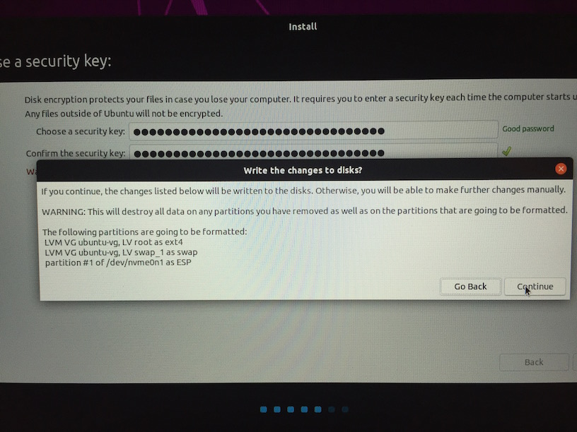

Installing Ubuntu 19.04 Disco Dingo
===================================

I have installed Ubuntu 19.04 on my new work laptop. My goal was to enable FDE. I have succeeded,
with help from my teammates. What follows is a log (with screenshots) of how the installation went.

laptop
------

Dell Precision 5530, x64-based
* intel i7 - 6 core, 2.60GHz
* 32.0 GB RAM
* secure boot on
* BIOS mode - UEFI

TL;DR
-----

The crucial screen to get to on the installer is this one (aka [step 6 in the official
tutorial](https://tutorials.ubuntu.com/tutorial/tutorial-install-ubuntu-desktop#5)).

After this it was easy. Was prompted for a security key to encrypt|decrypt the installation (I used
[Diceware](http://world.std.com/~reinhold/diceware.html)). Got this confirmation screen:

> The following partitions are going to be formatted:
> LVM VG ubuntu-vg, LV root as ext4
> LVM VG ubuntu-vg, LV swap_1 as swap
> partition #1 of /dev/nvme0n1 as ESP

And then the installatin proceeded. It's worth noting that, at least on my laptop, the "Encrypt..."
and "Use LVM..." checkboxes were linked. That is, checking|unchecking one automatically
checked|unchecked the other. So evidently encrypting the main partition implies that LVM will be
used on that encrypted partition.

And now, when I boot the laptop, I'm prompted for that security key.

Nauseating Details
------------------

But getting to that screen took some doing. I had to
* prepare a bootable ubuntu live SD card
* in BIOS (`F2` on bootup)
  * enable secure boot from SD card
  * change `SATA` setting to `AHCI`

TIL
---

Along the way I learned (or was reaquainted with) 
* UEFI (Unified Extensible Firmware Interface) aka EFI - specification for software interface
  between firmware and OS; replaces legacy BIOS. Works with newer GPT and older MBR partitioning
  schemes.
* GPT (GUID Partition Table) - disk partitioning scheme, alternative to PC's MBR (Master Boot Record)
* GRUB (GNU GRand Unified Bootloader) - 2nd stage boot loader
* NVMe
* PCIe
* M.2
* SATA
* AHCI
