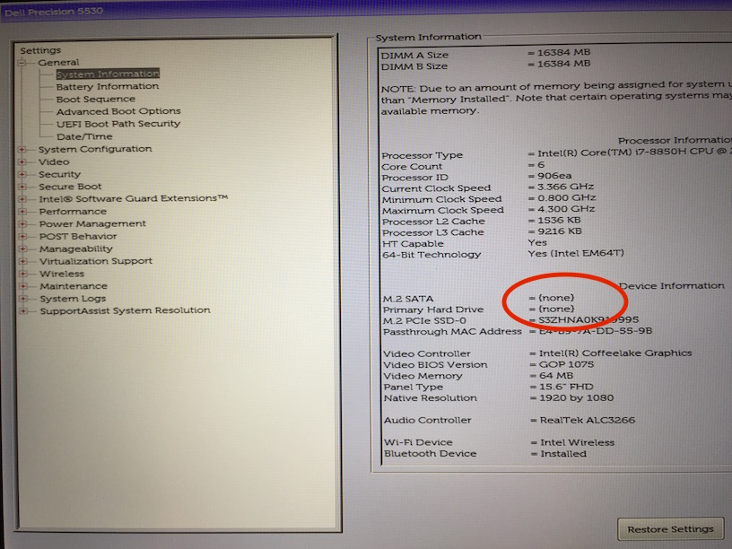
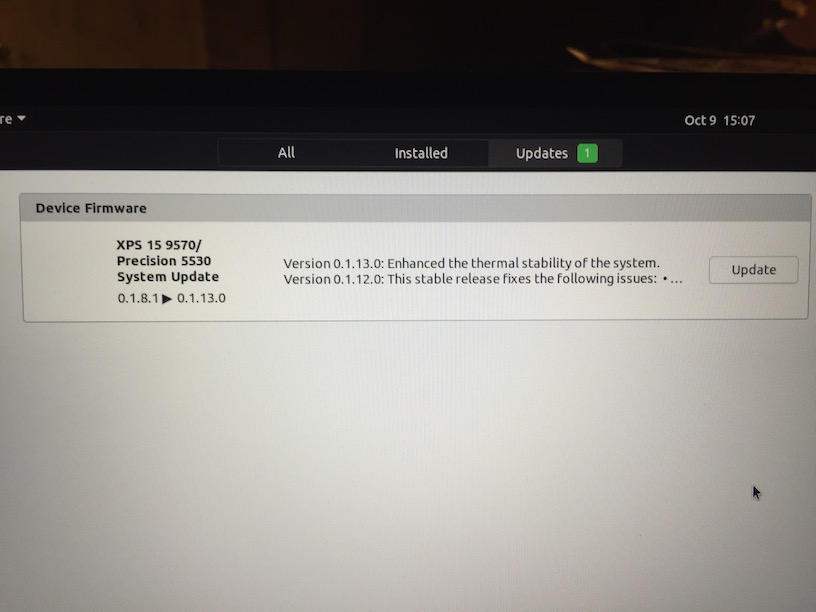

Installing Ubuntu 19.04 Disco Dingo
===================================

I have installed Ubuntu 19.04 on my new work laptop. My goal was to enable FDE. I have succeeded,
with help from my teammates. What follows is a log (with screenshots) of how the installation went.

laptop
------

Dell Precision 5530, x64-based
* intel i7 - 6 core, 2.60GHz
* 32.0 GB RAM
* secure boot on
* BIOS mode - UEFI

TL;DR
-----

The crucial screen to get to on the installer is this one (aka [step 6 in the official
tutorial](https://tutorials.ubuntu.com/tutorial/tutorial-install-ubuntu-desktop#5)).

After this it was easy. Was prompted for a security key to encrypt|decrypt the installation (I used
[Diceware](http://world.std.com/~reinhold/diceware.html)). Got this confirmation screen:

> The following partitions are going to be formatted:
> * LVM VG ubuntu-vg, LV root as ext4
> * LVM VG ubuntu-vg, LV swap_1 as swap
> * partition #1 of /dev/nvme0n1 as ESP

And then the installatin proceeded. It's worth noting that, at least on my laptop, the "Encrypt..."
and "Use LVM..." checkboxes were linked. That is, checking|unchecking one automatically
checked|unchecked the other. So evidently encrypting the main partition implies that LVM will be
used on that encrypted partition.

And now, when I boot the laptop, I'm prompted for that security key.

Nauseating Details
------------------

But getting to that screen took some doing. I had to
* prepare a bootable ubuntu live SD card
* in BIOS (`F2` on bootup)
  * enable secure boot from SD card
  * change `SATA` setting to `AHCI`
  
### bootable SD card

prepare live SD card
* download .iso, verify checksum

        echo "2da6f8b5c65b71b040c5c510311eae1798545b8ba801c9b63e9e3fd3c0457cbe *ubuntu-19.04-desktop-amd64.iso" | shasum -a 256 --check

* format SD card (from OS X, to be booted by PC) - results in (expected) error message "disk not readable"; eject SD

        hdiutil convert ubuntu-19.04-desktop-amd64.iso -format UDRW -o ubuntu-19.04-desktop-amd64.img
        diskutil list
        diskutil unmountDisk /dev/disk2
        sudo dd if=ubuntu-19.04-desktop-amd64.img.dmg of=/dev/disk2 bs=1m

### tweak system settings (aka BIOS)

`F2` during bootup to enter BIOS

To securely boot from the SD card:
* `System Configuration`->`Miscellaneous Devices`
* Enable `Secure Digital (SD) Card Boot`

Because this laptop only has a PCIe based m2 drive 
* `Settings`->`General`->`System Information` - under `Devices`, it's showing `M.2 SATA` and
  `Primary Hard Drive` as `{none}`, and the SSD uuid is listed under `M.2 PCIe SSD-0`
* Change the `SATA` setting to `AHCI`
* see [this kbase](https://www.dell.com/support/article/au/en/aubsd1/sln299303/loading-ubuntu-on-systems-using-pcie-m2-drives?lang=en)

### boot from installer

Dell Precision boot menu - F12

        Boot mode is set to: UEFI; Secure Boot: ON

What else?
----------

I had a few kernel panics along the way. No rhyme or reason to them that I could tell, just
sometimes happened as I tried to boot from the SD card. I'd have to lean on the power button and try
again.

Soon after the first bootup I was prompted to upgrade the firmware.

I did try disabling [secure boot](https://wiki.ubuntu.com/UEFI/SecureBoot). But when it was
disabled, then the ubuntu SD card was no longer an option to boot from. IIRC, on this particular
laptop, disabling secure boot implied changing the boot strategy from UEFI to classic/legacy MBR
boot strategy, which the UEFI SD card was incompatible with. According to my manager, the two
concepts (secure-boot and EFI) are not necessarily coupled, and there may be other BIOS settings to
allow me to decouple them.

TIL
---

Along the way I learned (or was reaquainted with) 
* UEFI (Unified Extensible Firmware Interface) aka EFI - specification for software interface
  between firmware and OS; replaces legacy BIOS. Works with newer GPT and older MBR partitioning
  schemes. You'll read about EFI firmware.
* GPT (GUID Partition Table) - disk partitioning scheme, alternative to PC's MBR (Master Boot Record)
* GRUB (GNU GRand Unified Bootloader) - 2nd stage boot loader
* NVMe (NVM Express, Non-Volatile Memory Host Controller Interface Spec) - spec for accessing a
  non-volatile media attached via PCI Express bus. SSD drives are the common application. M.2 cards
  also.
* PCIe (PCI Express)
* M.2 (aka Next Gen Form Factor (NGFF)) - spec for internally mounted expansion cards. Replaces
  mSATA. Until I enabled AHCI, my laptop's SSD drive registered as an "M.2 PCIe" SSD (and not an M.2
  SATA device). Supports both NVMe and (legacy) AHCI as logical device interfaces.
* SATA (Serial ATA (AT Attachment)) - computer bus interface, connects host bust adapters to storage
  devices.
* AHCI (Advanced Host Controller Interface) - open host controller interface, by Intel, de facto
  standard. If not enabled by the motherboard and chipset, SATA controllers may not provide the full
  capability of SATA spec. (On my new laptop, the SSD SATA controller could be run in AHCI mode,
  RAID mode, or "SATA disabled" - different modes of operation)
* ACPI (Advanced Configuration and Power Interface) - open standard for OS to discover and configure
  computer hardware, specifically for power management. Although it ended up not being necessary, a
  teammate speculated I may need to pass flag to kernel at boot time to disable this. (The Dell
  kbase article above describes how to pass kernel flags at boot time.)
* LUKS (Linux Unified Key Setup) - only if erase hard disk on Ubuntu installation
* eCryptfs - claimed to be buggy now
